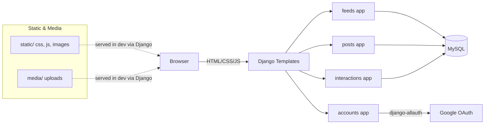

# README — Freespaces

A Django-based content-sharing app built as a learning project by a fresh graduate. The goal was to practice sound engineering practices while implementing a realistic stack: Google OAuth with django-allauth, a MySQL-backed data model for posts and interactions, and a simple but usable frontend with a rich text editor and AJAX interactions.

I’m early in my career, so I’ve kept the implementation straightforward and documented trade-offs along the way.

## Project Overview

- Freespaces lets people discover & share their creative journey through photography, programming, lifestyle, and more
- A minimal publishing platform with posts organized by categories.
- Google OAuth login, followed by a guided profile setup and username validation.
- Post creation with a rich text editor that supports pasting images from the clipboard.
- Interactions via likes and comments (AJAX).
- Clean templates and reusable includes for likes/comments.

## Key Features

- Google OAuth sign-in via django-allauth.
- Profile auto-creation, profile setup flow, and username validation API.
- Post CRUD with category filtering and search.
- Slug generation and legacy ID-based URL redirects.
- Like and comment interactions (AJAX JSON endpoints).
- Rich text editor with:
  - Font size, bold/italic/underline, lists, alignment, quotes, links.
  - Image upload and direct clipboard image paste at the cursor position.
  - Hidden field synchronization for form submission.

## Architecture



- `feeds/`: landing page, search.
- `accounts/`: OAuth callback, profile setup, username management, profile edits.
- `posts/`: list, detail (with related posts), create/edit/delete, category views, legacy redirects.
- `interactions/`: likes and comments via JSON-based AJAX.
- `templates/`: base layout, app pages, includes for comments and like button.
- `static/js/`: `main.js` (AJAX/UX) and `editor_toolbar.js` (rich text).

## Project Structure

- **`freespaces/`**: Django project config.
  - `settings.py`: apps, middleware, DB (MySQL), sites, allauth, sessions, static/media.
  - `urls.py`: routes to `feeds/`, `accounts/`, `auth/` (allauth), `posts/`, `interactions/`.
- **`feeds/`**: home and search pages.
  - `views.py`, `urls.py`, templates under `templates/feeds/`.
- **`posts/`**: post CRUD and categories.
  - `models.py`, `views.py`, `forms.py`, `urls.py`, templates under `templates/posts/`.
- **`interactions/`**: likes and comments (AJAX JSON API).
  - `models.py`, `views.py`, `urls.py`, partials under `templates/includes/`.
- **`accounts/`**: OAuth login and profile.
  - `models.py` (`Profile`), `views.py`, `forms.py`, allauth adapters `adapters.py`, templates under `templates/accounts/`.
- **`templates/`**: `base.html` layout, app pages, reusable includes.
- **`static/`**: CSS/JS/images, including `static/js/main.js` and `static/js/editor_toolbar.js`.

## Django Deep Dive (How it works)

### Settings & Configuration — `freespaces/settings.py`
- **Apps**: Django contrib apps, `django.contrib.sites`, social auth via `allauth`, local apps: `feeds`, `accounts`, `posts`, `interactions`, and `widget_tweaks`.
- **Database**: MySQL configured under `DATABASES['default']`.
- **Templates**: `DIRS=[BASE_DIR/'templates']`, `APP_DIRS=True`, context processors include `request` (required by allauth).
- **Static/Media**: `STATIC_URL`, `STATICFILES_DIRS=['static']`, `MEDIA_URL`, `MEDIA_ROOT`.
- **Auth**: `AUTHENTICATION_BACKENDS` includes `allauth.account.auth_backends.AuthenticationBackend`.
- **Allauth**: `ACCOUNT_*` and `SOCIALACCOUNT_*` configured. Google provider under `SOCIALACCOUNT_PROVIDERS['google']` with client ID/secret loaded via `python-decouple`.
- **Sites**: `SITE_ID=1` (make sure the site domain matches your environment in admin).
- **Redirects**: `LOGIN_URL='/accounts/oauth-login/'`, `LOGIN_REDIRECT_URL='/accounts/oauth/callback/'` to a custom handler.

### URL Routing — `freespaces/urls.py`
- Includes app routes with namespaces: `''→feeds`, `'accounts/'→accounts`, `'auth/'→allauth`, `'posts/'→posts`, `'interactions/'→interactions`.
- Serves media in development via `static(settings.MEDIA_URL, ...)` when `DEBUG=True`.

### Feeds app — `feeds/`
- **Models — `feeds/models.py`**: no database models defined; the app focuses on read-only views over posts and categories.
- **Views — `feeds/views.py`**
  - **`views.home(request)`**
    - Shows all published posts via `Post.objects.filter(status='published').select_related('author', 'category').order_by('-created_at')`.
    - Loads all `Category` objects ordered by name.
    - Context: `recent_posts`, `categories`.
    - Template: `templates/feeds/home.html`.
  - **`views.search(request)`**
    - Accepts `?q=`. If empty, returns 0 results.
    - Filters published posts with `Q(title__icontains=q) | Q(category__name__icontains=q)`, uses `select_related('author','category')` and `distinct()`.
    - Popular categories: `Category.objects.annotate(post_count=Count('post', filter=Q(post__status='published')))`; pads to 10 with remaining categories ordered by name.
    - Context: `posts`, `query`, `total_results`, `popular_categories`.
    - Template: `templates/feeds/search.html`.
- **URLs — `feeds/urls.py`**
  - `''` → `home` (name: `home`).
  - `'search/'` → `search` (name: `search`).

### Posts app — `posts/`
- **Models — `posts/models.py`**
  - `Category`
    - Purpose: groups posts by topic (e.g., Photography, Programming).
    - Fields:
      - `name` (unique short text)
      - `created_at` (when the category was added)
    - Methods:
      - `get_absolute_url()` links to the category page.
    - Relationship: one category can be linked to many posts.
  - `Post`
    - Purpose: a single article/post.
    - Key fields:
      - `title` (short text shown in lists and detail)
      - `slug` (URL part). If you leave it empty, the code automatically creates a unique, URL‑friendly value from the title and appends a number when needed.
      - `content` (main body as HTML from the rich text editor)
      - `author` (link to `auth.User`; if a user is deleted, their posts are deleted too because of `on_delete=models.CASCADE`)
      - `category` (optional link to `Category`; if the category is removed, this becomes `NULL` due to `on_delete=models.SET_NULL`)
      - `featured_image` (optional image uploaded to `post_images/`)
      - `status` (either `'draft'` or `'published'`)
      - `created_at`, `updated_at` (timestamps set automatically)
      - `published_at` (set automatically the first time a post is saved as `'published'`)
    - Behavior:
      - Slug generation trims very long values, handles special characters, and ensures uniqueness.
      - Default ordering: newest posts first.
      - `excerpt` property: returns the first 150 characters to use in previews.
      - Trade‑off: if you later set a post back to draft, `published_at` stays filled (kept simple for this project).
- **Forms — `posts/forms.py`**
  - `PostForm`
    - Fields: `title`, `content`, `category`, `featured_image`, `status`.
    - Widgets: Tailwind-styled inputs; `featured_image` accepts `image/*`.
    - `__init__`: sets `category.empty_label = "Select a category (optional)"`.
    - Usage: in `post_create`/`post_edit`, bind with `request.FILES` for image uploads; templates replace `content` with a custom rich text editor synced to a hidden `<textarea>`.
- **Views — `posts/views.py`**
  - `post_list(request)`
    - Loads published posts with `select_related('author','category')`.
    - Optional filters: `?category=<name>` and `?search=<text>` (matches title or category name case-insensitively).
    - Context: `posts`, `categories`, `current_category`, `search_query`.
    - Template: `templates/posts/post_list.html`.
  - `post_detail(request, slug)`
    - Fetches by `slug` with `select_related('author','category')`.
    - If `status='published'`: visible to all; if `draft`: only the author can view; otherwise raises `Http404`.
    - `related_posts`: up to 4 other published posts by the same author.
    - Template: `templates/posts/post_detail.html`.
  - `post_create(request)` [login required]
    - On POST: bind `PostForm(request.POST, request.FILES)`, set `author=request.user`, save, `messages.success(...)`, redirect to `posts:detail`.
    - On GET: render empty form.
    - Template: `templates/posts/post_create.html`.
  - `post_edit(request, slug)` [login required]
    - Only the author can edit: `get_object_or_404(Post, slug=slug, author=request.user)`.
    - On POST: bind `PostForm(..., instance=post)`, save, flash success, redirect.
    - On GET: render form prefilled with the post.
    - Template: `templates/posts/post_edit.html`.
  - `post_delete(request, slug)` [login required]
    - Only the author can delete; confirms via form; on POST deletes and redirects home with a success message.
    - Template: `templates/posts/post_delete.html`.
  - `my_posts(request)` [login required]
    - Lists the current user’s posts with category preloaded.
    - Template: `templates/posts/my_posts.html`.
  - `category_posts(request, category_name)`
    - Shows published posts for a given category; 404 if the category name doesn’t exist.
    - Template: `templates/posts/category_posts.html`.
  - Legacy redirects
    - `post_detail_redirect(request, pk)` → 301 to the slug URL.
    - `post_edit_redirect(request, pk)` → 301 to `/posts/<slug>/edit/` (author required).
    - `post_delete_redirect(request, pk)` → 301 to `/posts/<slug>/delete/` (author required).
- **URLs — `posts/urls.py`**
  - `''` → `post_list` (name: `list`).
  - `'create/'` → `post_create` (name: `create`).
  - `'my-posts/'` → `my_posts` (name: `my_posts`).
  - `'<slug:slug>/'` → `post_detail` (name: `detail`).
  - `'<slug:slug>/edit/'` → `post_edit` (name: `edit`).
  - `'<slug:slug>/delete/'` → `post_delete` (name: `delete`).
  - `'category/<str:category_name>/'` → `category_posts` (name: `category`).
  - Legacy: `'id/<int:pk>/'` → `post_detail_redirect`; `'id/<int:pk>/edit/'` → `post_edit_redirect`; `'id/<int:pk>/delete/'` → `post_delete_redirect`.

### Interactions app — `interactions/`
- **Models — `interactions/models.py`**
  - `Like`
    - Purpose: records that a user liked a post.
    - Fields:
      - `user` → `auth.User` (`related_name='likes'`)
      - `post` → `posts.Post` (`related_name='likes'`)
      - `created_at` (when the like was created)
    - Constraints & behavior:
      - Unique together on `(user, post)` prevents duplicate likes.
      - Default ordering: newest likes first.
  - `Comment`
    - Purpose: a message left on a post.
    - Fields:
      - `user` → `auth.User` (`related_name='comments'`)
      - `post` → `posts.Post` (`related_name='comments'`)
      - `content` (text up to 1000 characters)
      - `created_at`, `updated_at` timestamps
    - Behavior:
      - Default ordering: newest comments first.
- **Views — `interactions/views.py`**
  - `toggle_like(request, post_id)` [login, POST]
    - URL: `/interactions/like/<post_id>/`.
    - Behavior: toggles a `Like` for the current user and the published post. Returns JSON `{ liked: bool, like_count: number }`.
  - `add_comment(request, post_id)` [login, POST]
    - URL: `/interactions/comment/add/<post_id>/`.
    - Inputs: form-encoded `content` (required, max 1000 chars). Returns 400 JSON on missing/too-long content.
    - Response: JSON `{ success: true, comment_html: string, comment_count: number }`. `comment_html` is rendered with `includes/comment_item.html`.
  - `get_comments(request, post_id)` [GET]
    - URL: `/interactions/comments/<post_id>/?page=<n>`.
    - Pagination: 10 comments per page using `Paginator`.
    - Response: JSON `{ comments_html, has_next, has_previous, current_page, total_pages, comment_count }` using `includes/comments_list.html`.
  - `delete_comment(request, comment_id)` [login, POST]
    - URL: `/interactions/comment/delete/<comment_id>/`.
    - Author-only: returns 403 JSON if the current user is not the comment author. On success: `{ success: true, comment_count }`.
  - Notes: All POST requests require CSRF. These endpoints are consumed by `static/js/main.js`.
- **URLs — `interactions/urls.py`**: namespaced endpoints `like/`, `comment/add/`, `comments/`, `comment/delete/`.

### Accounts app — `accounts/`
- **Models — `accounts/models.py`**
  - `Profile`
    - Purpose: stores extra information about each user.
    - Relationship: one‑to‑one with `auth.User` (each user has exactly one profile).
    - Fields:
      - OAuth: `google_id` (nullable/optional), `profile_picture_url` (URL string from Google)
      - Profile info: `bio` (short text), `avatar` (image in `profile_pics/`, default `profile_pics/default.jpg`), `website`, `location`
      - Social links: `facebook_url`, `instagram_url`, `tiktok_url` (all optional)
      - Tracking: `profile_setup_complete` (boolean), `created_at`, `updated_at`
    - Properties:
      - `posts_count`: number of published posts by this user
      - `likes_received`: total likes across the user’s published posts
    - Behavior:
      - `__str__` shows “<username>'s Profile”; `get_absolute_url()` points to the profile page
      - `save()` validates the connected username via `validate_username()`
      - Signals automatically create a `Profile` when a `User` is created and keep it saved thereafter
  - `validate_username(username)`
    - Purpose: makes usernames safe and readable.
    - Rules: 3–20 characters; only letters, numbers, and underscore; common reserved names (e.g., `admin`, `root`, `support`, `api`, `www`) are blocked. A leading `@` is allowed for display but stripped before checking.
- **Forms — `accounts/forms.py`**
  - `UserUpdateForm`: update `first_name`, `last_name`, `email`.
  - `ProfileUpdateForm`: update `bio`, `avatar`, `website`, `location`, `facebook_url`, `instagram_url`, `tiktok_url` (Tailwind-styled widgets).
  - `AvatarUpdateForm`: hidden file input (`accept='image/*'`) for avatar uploads/cropper flow.
  - `NameUpdateForm`: update first/last name.
  - `BioUpdateForm`: update bio with a small textarea.
  - `SocialLinksUpdateForm`: update `facebook_url`, `instagram_url`, `tiktok_url`.
  - `UsernameUpdateForm`: updates `username`; `clean_username()` uses `validate_username()` and enforces uniqueness excluding the current user.
- **Allauth Adapters — `accounts/adapters.py`**
  - `CustomAccountAdapter`
    - `is_open_for_signup()` returns True.
    - `save_user(...)` ensures a username exists via `generate_unique_username()` before saving (fallback username; users can change during profile setup).
  - `CustomSocialAccountAdapter`
    - Redirect overrides: `get_login_redirect_url`, `get_signup_redirect_url`, `get_connect_redirect_url` → `/accounts/oauth/callback/`.
    - `pre_social_login(...)`: if an account with the same email exists, connects the social login to the existing user to avoid duplicate signups.
    - `save_user(...)`: fills `email`, `first_name`, `last_name`; generates username if missing; creates/updates `Profile` with `google_id` and `profile_picture_url`; sets `profile_setup_complete=True` only if an existing user already completed setup, else False.
    - Username helpers: `generate_unique_username(...)`, `make_username_unique(...)`, `generate_random_username()` ensure readable, unique, length-limited usernames.
    - `populate_user(...)`: leaves final username choice to the profile-setup flow (no auto-populate at this step).
- **Views — `accounts/views.py`**
  - `oauth_callback_handler(request)` [login]
    - Ensures a `Profile` exists; tries to read Google `SocialAccount` and store `google_id` and `profile_picture_url` on the profile.
    - New or incomplete profiles are redirected to `accounts:profile_setup`; completed profiles go to `feeds:home`.
  - `profile_setup(request)` [login]
    - POST: receives `username`, validates with `validate_username`, ensures uniqueness; updates `User.username`.
    - Optional base64 avatar under `profile_image_data`; decodes and saves as `Profile.avatar`; deletes old non-default avatar.
    - Sets `profile_setup_complete=True`, shows a welcome message, redirects to home.
    - GET: fetches `google_data` for display; shows blank suggested username.
  - `validate_username_api(request)` [login]
    - Accepts JSON (`application/json`) or form data; returns JSON `{ valid: bool, clean_username?, error? }`.
  - `update_username(request)` [login, POST]
    - Uses `UsernameUpdateForm`; redirects back to profile or settings depending on `HTTP_REFERER`; shows messages on success/errors.
  - `update_avatar(request)` [login, POST]
    - Supports base64 `cropped_image` uploads (decoded and saved) or regular file uploads; deletes previous non-default avatar.
  - `update_name`, `update_bio`, `update_social_links` [login, POST]
    - Simple form submissions with success/error messages.
  - `profile(request, username=None)`
    - View own or others’ profile; if viewing own, injects inline edit forms; unauthenticated users hitting their own profile route are redirected to login.
  - `account_settings(request)` [login]
    - Renders `accounts/account_settings.html` (OAuth-only settings page).
  - `delete_account(request)` [login, POST]
    - Requires `confirm_deletion='DELETE'`; logs out, deletes the user (cascade deletes profile), flashes a message, redirects home; otherwise flashes an error.
- **URLs — `accounts/urls.py`**
  - `'oauth/callback/'` → `oauth_callback_handler` (name: `oauth_callback`).
  - `'profile/setup/'` → `profile_setup` (name: `profile_setup`).
  - `'api/validate-username/'` → `validate_username_api` (name: `validate_username_api`).
  - `'update-username/'` → `update_username` (name: `update_username`).
  - `'oauth-login/'` → renders `accounts/oauth_login.html` (name: `oauth_login`).
  - `'profile/'` and `'profile/<str:username>/'` → `profile` (name: `profile`).
  - `'update-avatar/'`, `'update-name/'`, `'update-bio/'`, `'update-social/'` → respective update views.
  - `'settings/'` → `account_settings` (name: `account_settings`).
  - `'delete-account/'` → `delete_account` (name: `delete_account`).

### Templates & Context — `templates/`
- **Layout — `templates/base.html`**: loads Tailwind CDN and `static` files; shows Google sign-in with `` or profile dropdown for `user.is_authenticated`; global nav links via ``; includes sitewide `static/js/main.js`.
- **Feeds**
  - `feeds/home.html`: uses `recent_posts` and `categories` from `feeds.views.home()`. Renders `includes/like_button.html`; applies emojis per category name; uses `post.excerpt|safe|truncatewords_html`.
  - `feeds/search.html`: consumes `posts`, `query`, `total_results`, and `popular_categories` from `feeds.views.search()`.
- **Posts**
  - `posts/post_list.html`: lists `posts` with filter/search; uses `categories`, `current_category`, `search_query`; includes `includes/like_button.html`.
  - `posts/post_detail.html`: shows `post`, `related_posts`; for published posts, renders like button and AJAX comments section.
  - `posts/post_create.html` & `posts/post_edit.html`: render `PostForm`; replace the `content` field with a custom rich text editor backed by `static/js/editor_toolbar.js` and a hidden `<textarea>` synced on input.
  - `posts/post_delete.html`: preview + confirmation form posting back to `posts:delete`.
- **Accounts**
  - `accounts/profile.html`: displays and edits profile inline (username, bio rich text, social links) with forms and base64 cropper flows.
  - `accounts/profile_setup.html`: onboarding for username and optional avatar with cropping.
  - `accounts/account_settings.html`, `accounts/oauth_login.html`: account settings and Google login page.
- **Includes**
  - `includes/like_button.html`: uses `user in post.likes.all` to set liked state and display `post.likes.count`.
  - `includes/comments_list.html` + `includes/comment_item.html`: server-rendered fragments returned by JSON endpoints.

### Frontend JavaScript — `static/js/`
- **`main.js`**
  - CSRF helper reads `csrftoken` for secure POSTs.
  - Likes: POST `/interactions/like/<post_id>/` and update DOM; animations for feedback.
  - Comments: POST add, GET paginated list, POST delete; builds UI with server-rendered HTML from endpoints.
  - Account settings helpers and light form UX enhancements.
- **`editor_toolbar.js`**
  - Rich text editor class attaching to `#editor` and syncing to the hidden `textarea` used by Django forms.
  - Text formatting (bold, italic, underline), lists, alignment, blockquotes, and font size options; link modal with selection preserved.
  - Inline image insertion and clipboard image paste: converts to base64 and inserts at the cursor with consistent styles.

## Tech Stack

- Django (5.2.4 as per header in `settings.py`).
- django-allauth (with Google provider).
- python-decouple (environment variables).
- django-widget-tweaks (form rendering).
- MySQL backend driver
  - Install `mysqlclient`.
  - All dependencies are declared in `requirements.txt`.

Frontend:
- Tailwind CSS via CDN in `templates/base.html`.
- Vanilla JS (`static/js/main.js`, `static/js/editor_toolbar.js`).

## Quickstart (Windows)

- Prerequisites:
  - Python 3.x
  - MySQL Server (local or remote)
  - Google Cloud project with OAuth 2.0 Client (Web) and Authorized redirect URI pointing to your django-allauth path under `auth/` (see Security notes).

- Create and activate a virtual environment:
```powershell
py -3 -m venv .venv
.\.venv\Scripts\activate
```

- Install dependencies:
```powershell
pip install -r requirements.txt
```

- Configure environment variables with `python-decouple`:
  - Create `.env` in the project root:
    ```
    GOOGLE_OAUTH_CLIENT_ID=your-google-client-id
    GOOGLE_OAUTH_CLIENT_SECRET=your-google-client-secret
    ```
  - These are read in `freespaces/settings.py` via `config('...')`.

- Database:
  - Create a database named `freespaces`:
    ```powershell
    mysql -u root -p -e "CREATE DATABASE freespaces CHARACTER SET utf8mb4 COLLATE utf8mb4_unicode_ci;"
    ```
  - Ensure credentials in `freespaces/settings.py` match your local MySQL user/password.

- Migrate and run:
```powershell
python manage.py migrate
python manage.py runserver
```

- Optional (admin access):
```powershell
python manage.py createsuperuser
```

- Google OAuth:
  - In Django admin under Sites (`django.contrib.sites`), edit Site ID=1 to match your local domain (e.g., `127.0.0.1:8000`).
  - Authorized redirect URI must point to the allauth callback under `auth/` (exact path depends on allauth; confirm in `/auth/` routes). Recommendation: follow django-allauth docs to set the callback path correctly.

## Environment Variables and Secrets

- Confirmed:
  - `GOOGLE_OAUTH_CLIENT_ID` (required)
  - `GOOGLE_OAUTH_CLIENT_SECRET` (required)

- Recommendation:
  - Move `SECRET_KEY` and `DEBUG` into `.env` for production.
  - Move database credentials into `.env`.

## Database Setup and Migration

- Database engine: MySQL (`freespaces/settings.py`).
- Default DB name: `freespaces`.
- Run:
  - `python manage.py migrate`
- Models (see code for exact fields):
  - `accounts.Profile` one-to-one with `auth.User`.
  - `posts.Category`, `posts.Post`.
  - `interactions.Like` (unique per user/post), `interactions.Comment`.

## Running the App + Common Commands

- Start dev server:
  - `python manage.py runserver`
- Create superuser:
  - `python manage.py createsuperuser`
- Make migrations (if you modify models):
  - `python manage.py makemigrations`
  - `python manage.py migrate`
- Collect static (production):
  - `python manage.py collectstatic`

## Endpoints Overview

- Feeds: home page and search.
- Accounts: OAuth callback, profile setup, username validation/update, profile viewing and edits (avatar, name, bio, social), account settings, and deletion.
- Posts: published list (with optional category and search filters), my posts, create/edit/delete, detail view, category view, and legacy ID→slug redirects.
- Interactions (AJAX JSON): toggle like; add, list (paginated), and delete comments.

## Authentication Flow

- User clicks “Sign in with Google” (`templates/base.html` uses ``).
- django-allauth handles OAuth. Custom adapters (`accounts/adapters.py`) redirect login/signup/connect to `/accounts/oauth/callback/`.
- Callback view (`oauth_callback_handler`) ensures a `Profile` exists and routes:
  - If profile is incomplete → `/accounts/profile/setup/` to choose username (validated via `validate_username_api`) and optional base64-cropped avatar.
  - If complete → home page.

## Frontend

- `templates/base.html` uses Tailwind CDN and includes a global nav with Google sign-in button.
- Rich text editor: `static/js/editor_toolbar.js`
  - Clipboard image paste support with preserved styling.
  - Modal for inserting links.
  - Hidden field syncing (`#hidden-content`) for form submission.
- Interactions: `static/js/main.js`
  - Like toggles and counts via AJAX (with CSRF).
  - Comment add/delete/list (paginated via AJAX).
  - Small UX details (animations, notifications, loading indicators).

## Testing

- Current repository does not include tests.
- Minimal plan:
  - Model tests for `Post` slug generation, `published_at` behavior, `Like` uniqueness, `Comment` constraints.
  - View tests for `posts` list/detail permissions (draft visibility), category filtering and search.
  - JSON endpoint tests for interactions (toggle like, add/delete comment).
  - Accounts flow: username validation API and profile setup transitions.
- Run (once tests exist):
```powershell
python manage.py test
```

## Deployment Considerations and Security Notes

- Environment
  - Set `DEBUG=False`.
  - Move `SECRET_KEY`, database credentials, and OAuth secrets to environment variables.
  - Update `ALLOWED_HOSTS`.
  - Configure `SITE_ID` and Site domain to match production host.
- Cookies and sessions
  - Set `SESSION_COOKIE_SECURE=True`, `CSRF_COOKIE_SECURE=True` on HTTPS.
  - Review SameSite settings for cross-site OAuth if needed.
- Static/Media
  - Run `collectstatic` and serve via your web server or a static file service.
  - Recommendation: Whitenoise or CDN for static files in production.
- Database
  - Use managed MySQL or ensure backups and proper credentials.
- OAuth
  - Ensure Google Authorized redirect URIs use the `/auth/` prefix (as routed in this project). Confirm the exact callback path from django-allauth in your configuration.
- Email
  - `EMAIL_BACKEND` is `console` in dev; configure a real backend for production.
- General
  - Keep dependencies updated in `requirements.txt`.
  - Apply Django security checklist.

## Credits and License

- Built by a fresh graduate as a learning project, referencing Django, django-allauth, and community resources.
